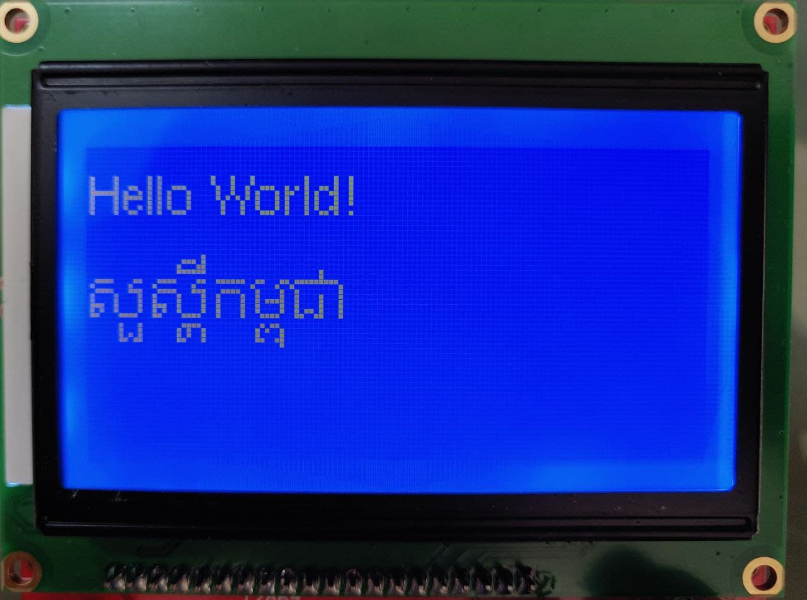

# U8g2 Khmer Arduino
This Arduino library is based on https://github.com/Sovichea/u8g2-khmer-support. It works with U8g2 library to display Khmer language on Graphical LCD of your choice using Arduino IDE. However, since the IDE doesn't not displaying Khmer Unicode. It is recommended that you use other editor to edit Khmer text.

Below is the result from the provided example:

